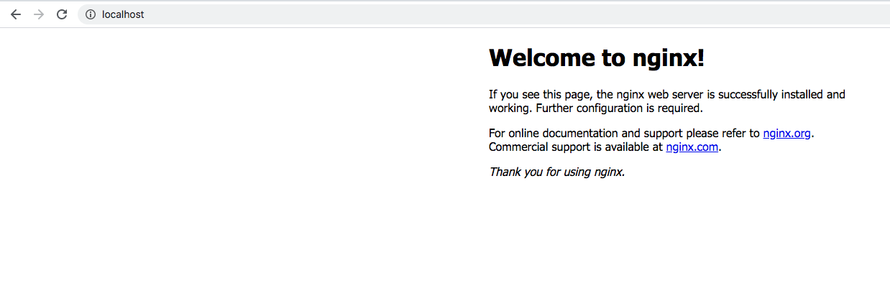
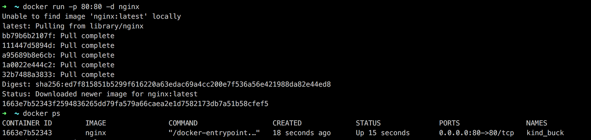
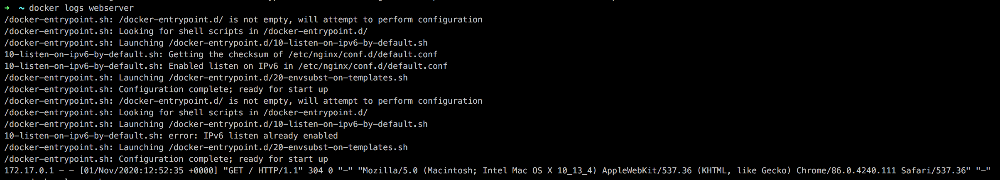
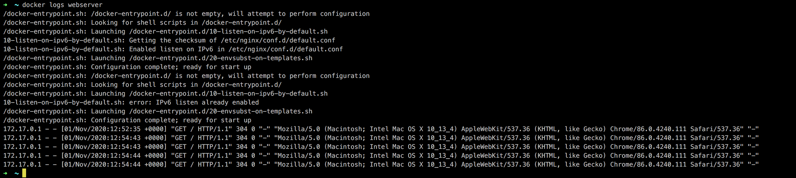
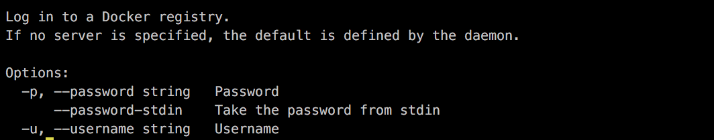

# Exploring the Docker world - Dockerventure Part 1

`TL;DR` Intro to Docker's basic functionallity and concepts. Keep reading if you are new to Docker or want to learn about it.

Today we are going to focus on a fundamental modern software technology, Docker. We are trying to analyze Docker by answering three simple questions around it. `What` is Docker, `why` should we adopt it's usage and `when` is the right time for this. We are going to explain some of it's `basic components` and the high level picture of how they work together. Finally we are going `hands-on` on our first Docker trip by spawning a `containerized webserver in seconds!` If you are already familiar with Docker but would like to check the second part of this Docker adventure where we investigate more advanced topics, click here: [Taming the Docker beast]

## What is this sorcery

Docker is an `open source tool` designed to make our lifes easier(or sometimes harder) regarding creating, building, deploying and run software applications. This is achieved by `packaging applications into containers` along with everything else they need, allowing them to be considered and deployed as one package. Our code with it's dependencies, libraries, tools, runtime environment and operating system are combined into `a standard unit of software` that can technically run in every environment without any other requirement, well apart from Docker itself being present. This is actually the magic of Docker, eliminating the need to care about different environments, installing dependencies while allowing our software to run on any machine. This means that Devs can focus on writing and developing their code  and Ops have a new flexible tool in their arsenal to help them manage complex software systems.

## Why should I use Docker

Containers are considered the `once in a decade shift in infrastructure` and if you are working in any sector related to softare development or IT this is one of the fundamental tools that you should know. It's actually the shift to the next object of computation as in some years(if not already) running software in containers will be the `default practice`. They are considered the `fastest growing cloud enabling technology` and Docker is kind of the face behind all this. There are of course other container tools but Docker is the defacto containerazion technology and definitely the most used one. The real power that Docker provides us though is `speed`. Speed of software development & delivery, speed of buidling and testing, speed of providing value, speed of bringing our software from idea to production. Even more, as previously mentioned in the What section, containers `reduce complexity` by allowing us to run and test the software everywhere the same way. That abstraction simplifies and makes easier to handle a lot of the problems around managing software lifecycle.

## When is the right time to start using Docker

I know that migrating or learning a new tool and technology can be challening but Docker makes this transition really smooth and focuses a lot on the `migration experience`. Finally we have a tool that can be used `easily by any role` in software development or IT like devs, ops, testers, build engineers, sysadmins etc and `NOW` is the time to jump on the docker ship. The nice thing about Docker is that it `doesnt require any code changes` to your existing software and that's actually one of the main reasons explaining why it has been adopted so quickly.

## Fundamental Docker Concepts

Before we jump into our first hands-on quick Docker trip lets first define some vocabulary that we 'll need.

### Image

An image is the application we would like to run along with binaries, libraries and everything that ultimately makes our source code, including also metadata about how to run it.

### Dockerfile

A Dockerfile is actually a `recipe` to create our Docker images. We are going to deep dive into Dockerfiles in next episode. For now if you want to have a look to the Dockerfile that we are going to use check [here](https://github.com/nginxinc/docker-nginx/blob/0dc809fa606828a78087cd0a824bed06268d73e0/mainline/buster/Dockerfile)

### Container

A container is a running instance of an image running as a `process`. So at the end containers are just processes limited by what resources they can access.

### Image Registry

Images are usually stored in registries and [Dockerhub](https://hub.docker.com/) is the default registry for Docker. Dockerhub is for docker images what Github is for source code.

## Ok enough with the blah blah, show us

Ok by now you should be full onboard on the Docker train chu chuuuu, demo time. If you dont have already Docker installed here is the link to the official documentation regarding [installation instructions](https://docs.docker.com/engine/install/) per platform. For this demo we are going to use the [nginx](https://www.nginx.com/) webserver image, which can be found [here](https://hub.docker.com/_/nginx).  

Go in your terminal and just run:

```bash
docker run -p 80:80 -d nginx
```

And dadaaaaaah you have an nginx webserver up and running. To validate go to your web browser and type: `localhost:80` and you should see something like this:



Well done running your first docker container! That was easy, wasnt it? Let's go see what happened there. When we run this command docker tried to look for a docker image named `nginx`, couldnt find any so it went to Dockerhub and downloaded the latest image and then started it in a newly created container. Also with the `-p 80:80` option we instructed our container to expose traffic on our host IP at port 80 and route it to the container IP port 80, pure magic. The `-d` option runs the container in the background and allows us to continue using the same terminal for other stuff. To verify this go back to your terminal and run the command that lists our running containers:

```bash
docker ps
```

And you should see something similar to this:



Note there are different info there, you get your container id(every container has a unique id), the image from which it spawned, the default command used when the container starts, when was your container created, it's status, what ports are exposed and a random & usually funny name attached to it(if you dont specifically specify one)

In order to stop a running container get the id from the above output and execute:

```bash
docker stop 1663e7b52343
```

now running the same command again should return nothing:

```bash
docker ps
```

If you want to see your stopped containers run:

```bash
docker ps -a
```

Ok lets say I want to specify a name for my container so that I can reference it easily and I dont have to grab the id every time, that can be achived by using the `--name` flag.

```bash
docker run -p 80:80 -d --name webserver nginx
```

Now if you execute again `docker ps` you will see that the container has the specified name and can be for example stopped by running:

```bash
docker stop webserver
```

If you stopped our webserver go ahead and restart the container by running:

```bash
docker start webserver
```

This starts again the same previously stopped container instead of the `run` command which will create a new one.

Ok what if we want to check how our webserver is doing? Lets go check some logs:

```bash
docker logs webserver
```

And you should see something similar to this:



Lets try to generate some more logs, go to your browser at `localhost:80` where our nginx webserver is exposed and hit the `refresh` button a couple of times.
Now lets execute again:

```bash
docker logs webserver
```

Now you should have more logs in your webserver showing all the get requests you just did:



If you like also you can follow the logs in the terminal by specifying the `-f` flag. Try

```bash
docker logs -f webserver
```

And back to your browser hit the refresh button a couple of times and you will see the log stream being updated real time.

The Docker tool has a lot of useful commands and you 'll have to play a bit with them in order to explore them all. To list all the different docker commands just run:

```bash
docker help
```

It returns a list of optios and commands. If for example you would like to learn more info regarding one specific command, for example the `login` command,  you can run:

```bash
docker help login
```

And you get more information regarding the `login` command



Alright, lets say we are done with our quick demo and we would like to clean our containers. Go ahead and run `docker ps -a` to list all your containers, running or not. In order to remove them, we 'll use the `docker rm` command. If you try to use this command on a running container you 'll get an error that you `can't remove a running container`. We 'll use `-f` flag to force the deletion in this case, note that it will be the same if you fist stopped the running containers with the `docker stop` command. Lets go and remove both the 2 containers we created previously in one go:

```bash
docker rm -f webserver 1663e7b52343
```

## Summary

Alright that was it folks, a quick intro to Docker answering What-Why-When questions around it, defining some basic components and finally getting our hands dirty with a small demo. Hope you enjoyed this as mush as I did and if you want to learn more check the second part of our Docker trip [Taming the Docker beast] where we deep dive into more advanced Docker topics and we are going to build our first Dockerfile.
