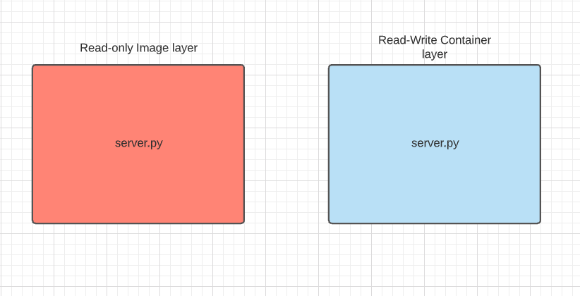
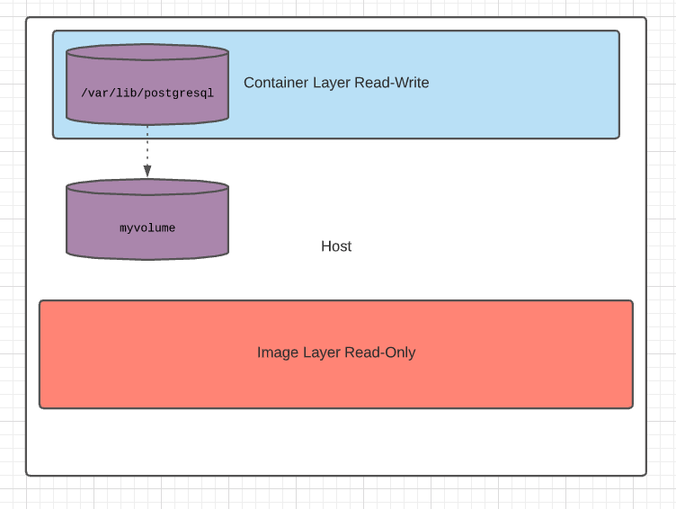

# Manage Docker Storage & Volumes - Dockerventure Part 4

`TL;DR` Overview of how docker storage & volumes work and how to manage them.


In this fourth part of the `Dockerventure` series we are going to focus on how docker handles storage how it manages contaner file systems and showcase how we can effectively manage storage with volumes. 

## Default Docker File System

At creation by default docker creates the directory `/var/lib/docker` where it stores all it's data regarding containers, images volumes etc. When a new container is started a new `read-write container layer` is added on top of the read only image layers that were created during build. This container layer exists only while the container exists and when the container is killed this layer along with all the changes we made on top are lost. This is useful in order for example to bash into a container and run some tests or debug issues etc.



For example if I bash inside my docker container that holds the `server.py` file and modify something and save it a copy of this file is actually saved on the `read-write temporary container layer` while the `image read-only layer` isn't affected.

## Persist data with volumes

In order to actually persist newly created data beyond the container's lifetime we can use `docker volumes`. In order to do this we can create a docker volume by executing `docker volume create myvolume`. This automatically creates a folder under `/var/lib/docker/volumes/myvolume` in your host.



Lets use this persistent volume while running a container. Let's say for example that we would like to spawn a `postgres database` container. We would like to preserve our db data even if for example our container stops, restarts or gets killed. In order to do this let's mount the postgres default `/var/lib/postgresql` directory inside the postgres container to my newly created `myvolume` by running:

```bash
docker run -v myvolume:/var/lib/postgres postgres
```

Note that when specifying the `-v` option we define the name of the volume on the left side of `:` and the path inside the container on the right side.

```bash
-v <volume_name>:<path_inside_the_container>
```

Now the directory `/var/lib/postgresql` inside the container is mounted on our `myvolume` volume on our host under `/var/lib/docker/volumes/myvolume` and any data written there will be persisted. This is called `volume mounting` as we are mounting one of the docker volumes.

Another option is to mount an already existing host directory to a directory inside the container. For example let's say we already have a directory configured with with lot's of capacity to store our db data under `/db_data`.

In this case instead of specifying a volume name we will specify a path on our host:

```bash
docker run -v /db_data:/var/lib/postgres postgres
```

This is called `bind mounting` and in this case after the `-v` option we define the path on the host on the left side of `:` and the path inside the container on the right side.

```bash
-v <path_on_the_host>:<path_inside_the_container>
```

Something to note here is that using `-v` is the old fashioned way while there is a new more verbose way to define mounts. The new prefered way is to use the `--mount` flag and define specifically the type of the mount. The last example using this options is transformed like this:

```bash
docker run --mount type=bind,source=/db_data,target=/var/lib/postgres postgres
```

## Storage drivers

All the above operations fall into the responsibility of storage drivers. Storage drivers allows us to create data in the writable layer of our container. There is a list of storage drivers used by docker and docker picks the best storage driver automatically available on our system. These drivers have different characteristics and selecting a specyfing one depends on our workload's use case and needs. For a detailed comparison and info check the official documentation [select-storage-driver](https://docs.docker.com/storage/storagedriver/select-storage-driver/)

To check what is the storage driver used in your system run:

```bash
docker info
```

## Summary

Fourth part of our Dockerventure our `storage` and `volumes` has come to an end. We discussed about how docker handles data, filesystems, volumes and layers. Showed examples of how to use `volumes`, the 2 different types of mounts `volume mounting` and `bind mounting` and in the end had a quick look on docker `storage drivers`.