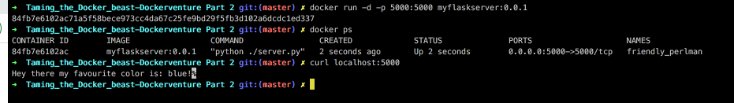

# Taming the Docker beast - Dockerventure Part 2

`TL;DR` Build and share your own managed docker images.


In this second part of the `Dockerventure` series we are going to focus on how we can define our own custom images with `Dockerfiles`, how we can build those images and publish them in `Dockerhub` so we can share them with the rest of the world!

## Docker images & Dockerfile basics

In Docker's world the images definitions are described inside a file called `Dockerfile`. The Dockerfile describes how to assemble an environment for a container that contains all the necessary information and metadata on how to run a container based on this image. In order to contenairize our applications we have to write Dockerfiles that define step by step how are images are built.

Lets look at one Dockerfile example and discuss it's building blocks. This Dockerfile defines an image that basically sets up a python flask server and shows a message with a color that we picked.

```Dockerfile
FROM python:3.7-alpine

# set env var color
ENV color=blue

# set working directory
WORKDIR /server

# copy the dependencies file to the working directory
COPY requirements.txt .

# install dependencies
RUN pip install -r requirements.txt

# copy the script file to the working directory
COPY server.py .

CMD [ "python", "./server.py" ]
```

The order of the commands in a Dockerfile matters as they are executed top down and each one of them is actually considered as one layer of our image.

### FROM

Lets start from the `FROM` command which is required in every Dockerfile. Its the initial image on top of which we start to build our custom one. Can be either a minimum Linux distribution or some image configured already with the basic tools we need for our application. In our case since we are going to run python script we used `python:3.7-alpine`.

### ENV

`ENV` refers to environment variable and is one of the ways to set them. These environtment variables are used extensively to inject key/value pairs for building and running containers. Environment variables are quite handy for these uses cases as they work on every os, config, environment. In our case we set the `color` we picked.

### RUN

`RUN` command is used to execute shell commands inside the container while it's building it. We use `RUN` to create files, folder, install dependencies, run shell scripts and various other tasks that we would like to run inside our container at creation time in order to prepare it. In order to combine multiple commands with the same `RUN` statement you can usee `&&`. This way we include multiple commands in a single layer in our image.

### WORKDIR

`WORKDIR` is changing the working directory inside our container.

### COPY

`COPY` is used in order to copy files inside the container. This is usefull in order to transfer for example executable files and various other files used by the container. In our case we copy our python script along with its dependencies.

### CMD

`CMD` is the final command that will be run everytime we launch a new container from this image or restart a container. In our case we are just executing our python app at runtime.

## Build an image from a Dockerfile

In order to build our Dockerfile and produce an image that can be used to create a containerized version of our app, we need to execute the `docker build` command. The docker build command requires just a path to use in order to set the build context if keep the default name `Dockerfile`. If we choose to pick a custom Dockerfile name it can be specified with the `-f` flag. We can also specify a custom tag and a repository at which to save the new image with the `-t` flag.

In order to build our image we have to run this command from the directory where our `Dockerfile1` lives.

```bash
docker build -t myflaskserver:0.0.1 -f Dockerfile1 .
```

In the above command we specify `-t` flag and we add a custom tag for our image, `myflaskserver`. We can also define a numbered version after `:` like `0.0.1`.

Alright if you try the above command with our Dockerfile you should have built an image locally. Lets verify this by executing:

```bash
docker images
```

There we can see our new image along with some info like `REPOSITORY` `TAG` `IMAGE` `ID` `CREATED` `SIZE`. Now we are ready to use our newly created image in order to generate a containerized version of our python flask server. Let's go ahead and try that.

```bash
docker run -d -p 5000:5000 myflaskserver:0.0.1
docker ps
```

Now try curl on localhost on port 5000 or open your browser at locahost:5000 and you should see a message like below:

```bash
curl localhost:5000
```



Amazing our containerized python server works as expected!
Let's try something else. Let's use the environment variable `color` to change the message. First lets kill the previous container by executing `docker rm -f <docker-container-id>`. Then:

```bash
docker run -d -p 5000:5000 -e color=green myflaskserver:0.0.1
```

And again if you try curl or go to your browser at `localhost:5000` you should see the color has changed:


## Publish a custom Docker image

Alright so far we have our custom image and verified that it works as expected. Next we would like to store this image on Dockerhub so we can share it with other people. In order to do that we ll need a `Dockerhub` account so if you dont have one go ahead and register [here](https://hub.docker.com/). After you created your account you can login from the command line with `docker login`.

In order to publish our image to our account on Dockerhub we must tag it using with the `docker account id` like that:
`docker build <Your Docker ID>/myflaskserver:0.0.1`

For example my Docker ID is `moustakis`:

```bash
docker build -t moustakis/myflaskserver:0.0.1 -f Dockerfile1 .
```

And then we can simply run:

```bash
docker push moustakis/myflaskserver:0.0.1
```

This will automatically create a public repository for our image go ahead and explore your newliy published image [here](https://hub.docker.com/repositories). Congrats on your first published image!

## Dockerfile Best Practises

As a last step lets examine some best practises on creating Dockerfiles and try to improve our previous Dockerfile a bit.

### Instruction order matters

To leverage efficiently the build cache mechanism place the instructions that tend to change more frequently after the ones that change less often. For example, taken from our previous Dockerfile our depencies tend to change less frequently than our code. So we decided to first copy the `requirements.txt` , install them and then copy the `server.py`. Notice that we could copy both the `requirements.txt` and `server.py` using the same layer but we chose not to in order to leverage the caching mechanism on the less often changed `requirements.txt`.

```Dockerfile
# copy the dependencies file to the working directory
COPY requirements.txt .

# install dependencies
RUN pip install -r requirements.txt

# copy the script file to the working directory
COPY server.py .
```

### Ephemeral containers

Keep in mind that containers by nature are destroyed and replaced all the time so the containers that we create with Dockerfiles should be able to terminate and rebuilt.

### Use .dockerignore

Similar to `.gitignore`, used to exlude filers that aren't relevant to thw build.

### Multi-stage builds FTW

By including files or packages that aren't necessary in our final image we end up with larger build times and larger image sizes. That results in more time to build, push and pull our images along with some other disadvantages like increasing the possible attack surface by some malicious outsider.

In order to avoid this we can create different stages in our Dockerfile, for example:

```Dockerfile
FROM python:3.7-alpine as base

ENV color=blue

FROM base as builder

RUN mkdir /install
WORKDIR /install

# copy the dependencies file to the working directory
COPY requirements.txt /requirements.txt

# install dependencies
RUN pip install --prefix=/install -r /requirements.txt

FROM base
COPY --from=builder /install /usr/local

# set the working directory in the container
WORKDIR /server

COPY server.py ./

ENTRYPOINT [ "python" ]
CMD ["./server.py" ]
```

In the above Dockerfile we use the `builder` stage to install build our dependencies but stip them from our final application image. The first stage is only used for building dependencies and we copy to our final stage only the necessary files that produced from the first stage. In order to define a stage we use the `as` to the `FROM` command as shown.

Go ahead and build this image and then run `docker images` and compare the size of the two images, the second one should be smaller:

```Dockerfile
docker build -t <Your Docker ID>/myflaskserver2:0.0.1 -f Dockerfile2 .
docker images
```

### Install only the necessary packages

It's never a good idea to install more stuff than you need, keep it simple and add only completely necessary packages otherwise you 'll find yourself fighting to maintain dependencies.

### One container for one job

Each of your images should be defined to execute one specific job. The Docker architecture favours decoupling applications as much as possible so try to separate your containers as much as possible. This way you can achieve horizontal scaling, reusability, easier maintance and faster development lifecycles.

## Some extra useful Dockerfile instructions

### LABEL

Labels can be added to the image for various reasons like organization, automation, versioning etc. Use the `LABEL` command followed by a `key-value` pair:

`LABEL version="0.0.1"`

### EXPOSE

Defines the ports on which the container listens for connections to be used.

## ENTRYPOINT

Defines the default command to run in container if specified. To overwrite we need to specify the command `--entrypoint` at runtime. If only `CMD` instruction exists then the `CMD` is executed and can be overwritten by placing in the end of the `docker run` another command. If an `ENTRYPOINT` is defined in a dockerfile then the value of `CMD` e.g. `CMD ["5"]` will be passed as a parameter to the value of ENTRYPOINT `ENTRYPOINT["sleep]`. In our second `Dockerfile` example we modifed the initial

```
CMD [ "python", "./server.py" ]
```

to:

```
ENTRYPOINT [ "python" ]
CMD ["./server.py" ]
```

This way we specify that `python` is the image's main command and the `"./server.py"` is the default flag passed to the entrypoint. For example if we would just like to check the python version we could specify the `--version` after our docker run command which will replace the execution of our python file `"./server.py"`.

## VOLUME

Used to define some persistent volumes for any mutable parts of the image. Anything that isn't consider ephemeral and should be persisted further the container's lifecycle.

## Summary

Alright second part of our Dockerventure has come to an end. Hope you enjoyed our deep dive to `Dockerfiles`. We explained and analyzed some of the fundamental and most used `Dockerfile instructions`, wrote a simple Dockerfile for our python server and learned how to build and push our custom images to `Dockerhub`. In the end we saw some best practices around Dockerfiles and tried to implement some of these in order to improve our first `Dockerfile`.
